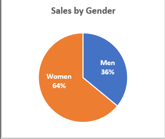
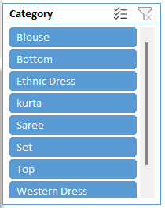
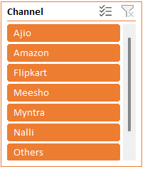
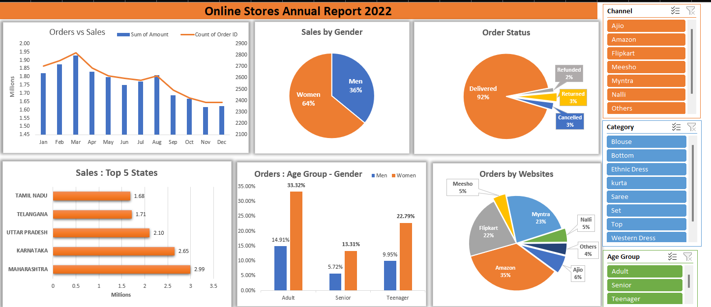

# Excel - Online Sales Data Analysis. 
-	Santhosh Victor Amburose. 
This project examines into sales data analytics to extract insights for strategic decision-making. Through demographic and regional analysis, we aim to enhance an interactive dashboard, guiding targeted marketing initiatives. By aligning strategies with identified trends, we seek to drive sustained business growth and optimize customer engagement.
## Contents:
1)	Data Cleaning
2)	Data Processing
3)	Data Analysis
4)	Creating Dashboard
5)	Key Insights
6)	Proposed Strategies

## Data Cleaning: 
Data cleaning in Excel is crucial for ensuring accuracy and reliability in analyses. By removing inconsistencies, errors, and duplicates, it enhances data quality, leading to more informed decision-making and reliable insights.
•	We can See that in Column “Gender” There are multiple values for the same Category. “M” and “Men” means the same as well as “W” and “Women”. We normalize the data and finalize on a common value.
•	In this case we changed “ M “ to “ Men “ and “W” to “Women” 
 
•	Also in the column “Qty” we can see that there are multiple data types string and integer, hence changed the string data types to the respective integer data type 
 

## Data Processing: 

Feature Extraction:

### Age Group: 
•	We use the formula “=IF(E2>50,"Senior",IF(E2>30,"Adult","Teenager"))” to get 3 categories of age groups from the age column 
•	Age<30 = “Teenager”
Age>=30 = “Adult”
Age>=50 = “Senior”

### Month:
•	We use the formula “=TEXT(G2,"mmm")” to get the first three letters of the month value of the respective date.
Data Analysis:

## Pivot Charts Analysis: 
Utilized Pivot tables to generate insightful Pivot Charts for the following analytical inquiries: 
### 1.Assessing the Monthly Performance: Examining aggregate monthly orders and sales figures.

 
### 2.Gender-based Sales Analysis: Evaluating sales metrics based on gender demographics. 

 
### 3.Orders Status Distribution: Investigating the distribution pattern of orders across different status categories. 

 
### 4.Top Sales Performing States: Identifying the top five states based on sales performance. 

 
### 5.Demographic Order Distribution: Analysing the distribution of order counts based on age group and gender. 

 
 
### 6.Website-specific Order Distribution: Investigating the distribution of order counts across different websites.

## Interactive Dashboard Enhancement: 
•	To enhance interactivity in the Excel dashboard, Slicers have been incorporated and strategically linked to all associated Pivot Charts. 
•	The Slicers encompass website, apparel category, and age group dimensions.
•	 This augmentation facilitates dynamic data exploration, allowing users to seamlessly filter and navigate through the dashboard content based on specific criteria. Such interactivity empowers data analysts to gain deeper insights, conduct targeted analyses, and swiftly adapt visualizations to evolving research questions.
•	 By incorporating Slicers, the dashboard becomes a more user-centric and flexible tool for effective data interpretation and decision-making.

   
     
Overall Dashboard:
 

## Key Insights: 

### 1.	Predominant Sales Demographic: Adult women emerge as the primary contributors to sales, indicating a notable preference for the products among this demographic. 

### 2.	Regional Sales Impact: Maharashtra stands out as the leading state in terms of sales contribution, closely followed by Karnataka. This geographical distribution highlights specific regions with significant market influence.

### 3.	 E-commerce Platform Preferences: Amazon takes the lead as the preferred online marketplace for product purchases, followed by Flipkart and Myntra. These insights shed light on the competitive landscape and consumer choices within the e-commerce sector.

## Proposed Strategies: 

1.	Targeted Marketing Approach: Focus on tailored advertising, promotions, and exclusive offers specifically designed for women customers within the age group of 30-49 years. This strategy aims to resonate with the preferences and needs of this demographic segment.

2.	Regional Marketing Emphasis: Concentrate marketing efforts on the states of Maharashtra, Karnataka, and Uttar Pradesh to capitalize on the strong sales presence observed in these regions. Localized campaigns can be crafted to align with the cultural and demographic nuances of each state. 

3.	E-commerce Platform Engagement: Leverage the popularity of Amazon, Flipkart, and Myntra by strategically showcasing ads, offers, and coupons on these platforms. This approach ensures visibility among the preferred online shopping destinations, maximizing the reach to the target audience. 

These strategies collectively aim to enhance engagement with the identified demographic and geographic segments, fostering increased sales and customer satisfaction.

